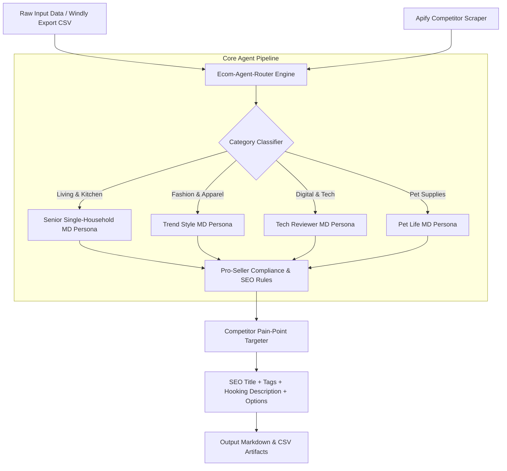

# 🚀 Ecom-Agent-Router (Windly AI Agent)

> **Autonomous AI Agent Framework for E-Commerce Listing Optimization with Dynamic MD Persona Switching & Competitor Intelligence**

[](https://opensource.org/licenses/MIT)
[](https://www.python.org/downloads/)
[](https://agentskills.io)
[](http://makeapullrequest.com)

[**English**](./README.md) | [**한국어 가이드**](./README_KR.md)

---

## 🌟 Key Features

- **🎭 Dynamic MD Persona Switching**: Automatically routes product items to specialized Merchandiser (MD) personas (e.g., *7-Year Senior Single-Household MD*, *Trend Style MD*, *Tech Reviewer MD*, *Pet Life MD*) based on product category detection.
- **🕵️‍♂️ Competitor Intelligence Integration**: Scrapes real-time competitor listings and review pain-points (via Apify REST API, Naver Shopping, Coupang) to generate high-converting Unique Selling Points (USPs).
- **🛡️ Instant Brand & Compliance Shield**: Built-in regex and heuristic filters for trademark violation prevention (e.g., removing unauthorized brand names like Xiaomi, Apple, Dyson) and false claim mitigation.
- **⚡ Scale-Proof Category Architecture**: Add new category-specific domain rules into `.agents/rules/categories/` as simple Markdown modules without code rewrites.
- **📊 Multi-Format Batch Export**: Automatically parses raw CSV/Excel data (e.g., Windly export) and outputs SEO-optimized product titles (60 chars), 15 long-tail tags, hook copy, and cleaned option lists into Markdown & CSV.

---

## 🏗️ System Architecture



---

## 🚀 Quick Start

### 1. Installation

```bash
git clone https://github.com/your-username/Windly-Product-Custom.git
cd Windly-Product-Custom
pip install -e .
```

### 2. Environment Setup

Copy `.env.example` to `.env` and set your optional API keys:

```bash
cp .env.example .env
```

```ini
APIFY_API_TOKEN=your_apify_token_here
```

### 3. Usage

#### Option A: Run via CLI

```bash
# Run batch customization on input products
ecom-agent run --input ./input/products.csv --output ./output/result.csv

# Run competitor analysis for target keywords
ecom-agent analyze --keywords "mini air fryer, 1-person rice cooker"
```

#### Option B: Run via Antigravity / Claude Code Agent

In Antigravity or Claude Code workspace:
```text
@product-customizer Process input files in ./input folder and generate optimized product listings.
```

---

## 📁 Repository Structure

```text
Windly-Product-Custom/
├── .agents/
│   ├── agents/
│   │   ├── product-customizer.md       # Dynamic MD Persona Switching Main Agent
│   │   └── competitor-analyzer.md      # Competitor Intelligence Analyst Agent
│   ├── rules/
│   │   ├── pro-seller-product-rules.md # Master Compliance & SEO Rules
│   │   └── categories/                 # Modular Category MD Persona Rules
│   │       ├── living-cook.md          # Kitchen & Single-Household MD
│   │       ├── fashion.md              # Fashion & Apparel MD
│   │       ├── digital.md              # Digital & Tech MD
│   │       └── pet.md                  # Pet Life MD
│   └── workflows/
│       └── batch-product-custom.md     # Batch Pipeline Workflow
├── ecom_agent/                         # Python Core SDK & CLI Source
│   ├── __init__.py
│   └── cli.py
├── input/                              # Raw Windly CSV / Apify Scraped Datasets
├── output/                             # Customized SEO Listings & CSV Exports
└── pyproject.toml
```

---

## 🤝 Contributing

Contributions are welcome! Please feel free to submit a Pull Request or open an Issue.

1. Fork the Project
2. Create your Feature Branch (`git checkout -b feature/AmazingFeature`)
3. Commit your Changes (`git commit -m 'Add some AmazingFeature'`)
4. Push to the Branch (`git push origin feature/AmazingFeature`)
5. Open a Pull Request

---

## 📄 License

Distributed under the MIT License. See [`LICENSE`](./LICENSE) for more information.
